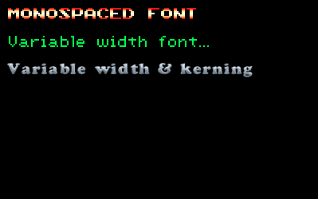

p5.bitmapFont 
=============



A [p5.js](http://p5js.org/) library that enables rendering bitmap fonts.


API
---

Usage:

```javascript
let monospacedFont,
    varWidthFont,
    varWidthFontWithKerning;

function preload() {
    monospacedFont = loadBitmapFont('data/sonicFont@2.png', {
        glyphWidth: 8 * 2,
        glyphHeight: 8 * 2,
        glyphBorder: 0,
        rows: 12,
        cols: 8,
        charSpacing: 2
    });

    variableWidthFont = loadBitmapFont('data/var-width/scumm.png', 'data/var-width/scumm.json');

    varWidthFontWithKerning = loadBitmapFont('data/var-width/cooper.png', 'data/var-width/cooper.json');
}

function setup() {
    createCanvas(400, 250);
}

function draw() {
    background(0);

    push();
    tint(0, 255, 0);
    bitmapTextFont(variableWidthFont);
    bitmapText(`Variable width font...`, 10, 40);
    pop();

    bitmapTextFont(monospacedFont);
    bitmapText(`monospaced font`, 10, 10);

    bitmapTextFont(varWidthFontWithKerning);
    bitmapText(`Variable width & kerning`, 5, 70);
}
```
TODO:
-----
- fix exposed currFont var
- jslint code
- test perf on non-static strings
- add static strings?
- add docs for scale
- add docs on how to export